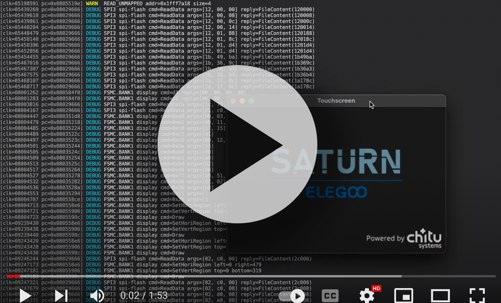
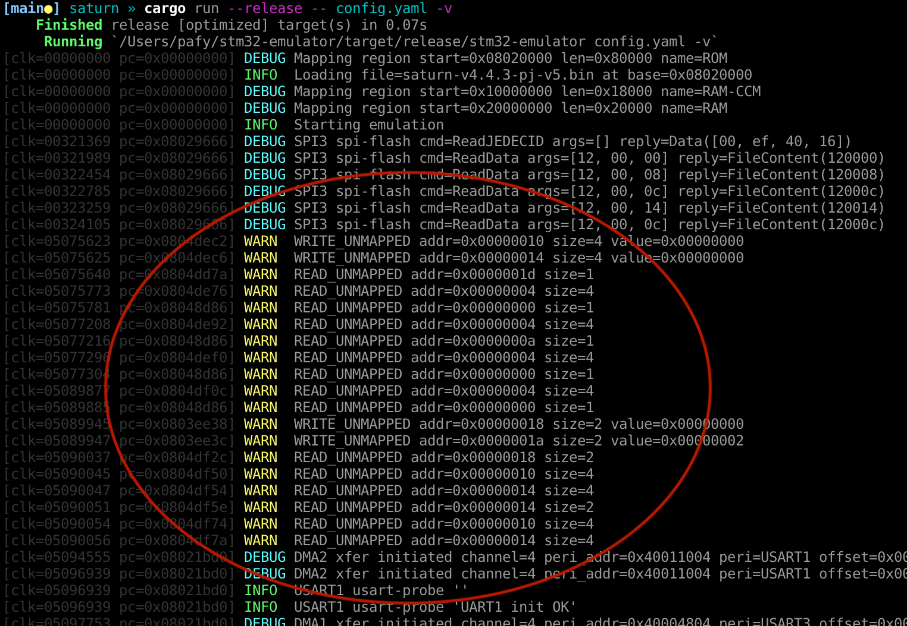

STM32 Emulator
==============

The goal is to simulate 3D printers, but any sort of stm32 microcontroller firmware should work.

The emulator is configured via a configuration file, see example
[here](https://github.com/nviennot/stm32-emulator/blob/main/saturn/config.yaml).

In the following example, I show how to emulate the 3D printer of the Elegoo
Saturn and Anycubic MonoX unmodified firmwares downloaded from the vendor website.

This emulator is done in the context of my work on [reverse engineering 3D
printers](https://github.com/nviennot/reversing-mono4k) so I can write a Rust
firmware for 3D printers, [Turbo Resin](https://github.com/nviennot/turbo-resin).

## Table of content

* [Emulating the Elegoo Saturn](#emulating-the-elegoo-saturn)
* [Emulating the Anycubic Mono X](#emulating-the-anycubic-mono-x)
* [Features](#emulator-features)
* [Existing Work](#existing-work)


## Emulating the Elegoo Saturn

In the [configuration file](https://github.com/nviennot/stm32-emulator/blob/main/saturn/config.yaml),
we provide an SVD file that provides all the peripheral register addresses for
the STM32F407. We then configure various memory regions, framebuffers, and
devices. We also patch two functions in the firmware just to speed things up as
we don't need to wait for our devices to initialize.

We also specify the firmware binary `saturn-v4.4.3-pj-v5.bin`, and that's the
official binary downloaded from the Elegoo website.  The `ext-flash.bin` is the
content of the external SPI flash dumped from the Saturn board itself (I cheated
a bit here, I wish we could have just used the downloaded version, it wasn't
working, and I was in a hurry).

### Youtube demo (click on the image)

[](https://www.youtube.com/watch?v=Uc8eq4JsJyM)

### Try it out

```
$ git clone https://github.com/nviennot/stm32-emulator.git
$ cd stm32-emulator/saturn
$ cargo run --release -- config.yaml -v
```

### The output

On the following we see some of the output.
We can see how the firmware initialize the display for example. These are
display commands we need to reproduce when implementing our own firmware.
We can also see that it's emitting something on the UART.
We also see its interaction with the SPI Flash.


We can also see that the firmware has issues. The init routines are messy from
what I've seen in the decompilation. In the emulation, we can see NULL pointer
exceptions, GPIO being re-configured multiple times.
On the STM32, address 0 is actually mapped to the flash, and so the memory
accesses in the first 4K don't actually fail, so failures of this nature go
silent.



We can see how the GPIOs are getting configured:


We can see how a specific peripheral gets initialized, like SPI2. That
information is coming right off the SVD file.


We can also do instruction tracing with `-vvvv`:


Overall, the emulator is useful to understand what the firmware is doing without
having the real printer on hand, which will be helpful in supporting additional
printers for TurboResin.

It would be fun to implement a GDB server provided by the emulator, this way we
could use GDB to inspect the runtime, and even connect a decompiler like Ghirda
or IDA Pro.

## Emulating the Anycubic Mono X

### Youtube demo (click on the image)

[](https://www.youtube.com/watch?v=VyB3ru0u4Go)

### Try it out

```
$ git clone https://github.com/nviennot/stm32-emulator.git
$ cd stm32-emulator/monox
$ cargo run --release -- config.yaml -v
```

---

## Emulator Features

* The ARM instructions are emulated via Unicorn (a Qemu fork). We can register
  hooks on memory read/write given memory range. This gives us a way to provide
  implementations for all the internal peripherals as they are all accessible
  via memory mapped registers. For example, writing `1` to the address `0x40020014`
  means that the pin `PA0` should be driven to +3.3V.
* There are a lot of registers, precisely 1537 of them for the STM32F407.
  The emulator is configured via a [vendor provided SVD
  file](https://github.com/stm32-rs/stm32-rs-mmaps). This way, we can easily
  emulate many different STM32s without having to worry about peripheral
  register addresses. The emulator also uses that to display traces of all
  register accesses, useful for debugging the firmware.
* The following internal peripherals are implemented, some just partially:
  - Systick: Used by the firmware to schedule tasks, and perform long delays.
    (short delays are typically done with empty `for` loops doing lots of
    iterations).
  - RCC: Clocks configuration. The firmware waits for the PLLs to be ready, so
    we must give the illusion that some PLLs are ready.
  - USART: Sometimes, the firmware emits debug messages (printf), we can collect
    these messages on these devices and print it on stdout.
  - SPI: SPI peripherals are connected to various external devices. For example,
    both the Saturn and the Anycubic Mono X use the SPI interface for access
    their on-board 16MB SPI flash.
  - I2C: There's an EEPROM on board to store settings, like if the sound should
    be on or off, or the chosen language.
  - FSMC: Normally used for connecting external SDRAM chips, this is used for
    connecting the display as this peripheral makes it easy to output data on
    16 wires in parallel in a single instruction.
  - GPIO: We want to see all the pin input/output configurations and monitor
    all activity. That's a really important part of figuring out what the system
    does.
  - Software SPI: This is not a real internal peripheral. Sometimes, the
    firmware implements its own bit-banging SPI algorithm by manipulating the
    GPIO port directly  to communicate to various devices. For example, the
    Saturn uses software SPI with the FPGA, and the Mono X uses software SPI to
    communicate with its resistive touchscreen.
  - DMA: The Saturn firmware uses DMA to send data to USART
    peripherals at times. This means that instead of writing to the USART
    data register one byte at a time, it instructs the DMA
    engine to copy a memory region to the USART data register, byte after byte,
    allowing the CPU to go do something else.
  - NVIC a.k.a. the interrupt controller: The Unicorn engine does not handle
    interrupts. We need it, as the Saturn OS uses PENDSV interrupts to perform
    context switches between different execution threads. Here's what was
    involved with implementing the interrupt controller. Here's how it works:
    - After every single executed instruction, we check if there's a pending
      interrupt that should be triggered.
    - We push all the needed registers onto the stack. There's actually two
      different stacks on the ARM CPU. The master stack and the process stack.
      The one in use is indicated through the Control register. We must
      also push floating point registers if they are enabled.
    - Then we setup the LR register to a special value that will turn a regular
      function return instruction into a return from interrupt instruction.
      That special value encodes whether we are using the master or process
      stack.
    - Next, we setup the PC register to point to the correct interrupt vector
      address configured via the vector table located at `0x08000000`.
    - When the function returns, we read the LR register (modifiable by the
      firmware to switch from the master stack to the process stack) to unwind
      the interrupt stack correctly.
* Next, we have external devices that can be plugged into internal devices like
  USART, FSMC, I2C, software SPI, or directly on a specific GPIO pin. I have
  implemented a few:
  - SPI flash: Both the Saturn and Mono X use a SPI flash to store things like
    fonts and graphics for the display. Reads happen at the same time as writes
    (full-duplex), making the implementation a big streaming state machine.
    There were challenging details such as supporting the SPI peripheral in both
    8-bit and 16-bit mode, and having everything configurable via a config file.
  - TFT display: This emulates an ILI9341 TFT display controller.
    firmware can instruct commands like "The following data is the pixel data
    to fill this (x1,y1,x2,y2) rectangle".  The pixel data can be configured to
    go in two different framebuffers:
    - A PNG file on disk, written after the emulation is stopped
    - A live window showing in real time the content of the display. This is
      implemented using the SDL2 library. I thought it would be a good idea
      to use this one because it's used for video games and other performance
      sensitive applications.
  - Touch screen: This emulates an ADS7846 resistive touch screen. There's
    various commands to handle, like MeasureX, MeasureY, MeasureZ (pressure),
    which can be configured to be read in either 8 or 12 bits precision.
    The Mono X relies on a separate GPIO pin to indicate when the display
    detects a touch. Implementing this was important otherwise, it would ignore
    the touch screen.
  - LCD panel: We emulate the FPGA driving the LCD panel. It decodes and sends
    the pixel data to a framebuffer similarly to the TFT display.
* The emulated system is configurable through a yaml file. See example below.
* Despite all the things we are doing, the emulator is reasonably fast. On my
  laptop, the emulator is able to run on at around 50Mhz. That's 1/3 of the real
  speed. That's much faster than the other emulators which are at least 10x
  slower, if not more.

## Existing work

There's some existing work in the STM32 emulation space:
* [Mini404](https://github.com/vintagepc/MINI404) emulates the Prusa Mini. Quite
  a feat. See the project's hw/arm/prusa for the peripherals.
* [Qiling](https://qiling.io/2022/04/14/intro/) emulates all kinds of devices,
  including STM32s. It would be a good candidate, but wasn't fitting the bill
  because 1) it's written in Python, and is very slow. 2) It doesn't support
  what I really want which is tracing in registers that I care about.
* [Renode](https://renode.io/): Emulate all sorts of devices, written in C#.
  The configuration files are finicky, and it's overall pretty slow. I didn't
  like it.
* [Tinylabs' flexsoc-cm3](https://github.com/tinylabs/flexsoc_cm3): This is
  Elliot's project to have the real stm32 peripherals to be accessible directly
  to a host that is emulating a CPU. I haven't tried it, but it looks promising.
* Use GDB and single step everything. That might be too slow.

License
-------

The code is released under the GPLv3
